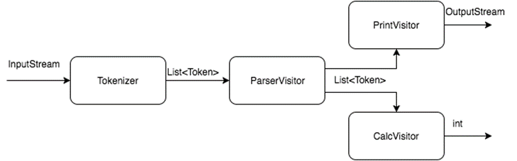
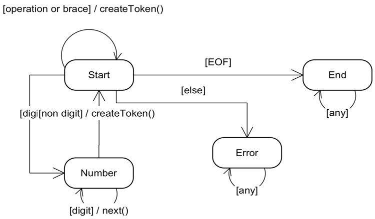

## Лабораторная работа 6. Парсер

Цель: получить практический опыт применения паттернов поведения visitor и state.

### Условие задания

Необходимо реализовать калькулятор, который умеет преобразовывать простые
арифметические выражения в [обратную польскую запись](https://ru.wikipedia.org/wiki/Обратная_польская_запись) (ОПЗ) и вычислять их. Примеры
выражения:
* `(23 + 10) * 5 – 3 * (32 + 5) * (10 – 4 * 5) + 8 / 2`
* `105 / (10 * 2 - 15)`

Выражение может содержать скобки, пробельные символы, цифры и 4 операции: `+`, `-`, `*`, `/`.
Для вычисления выражения его необходимо сначала разбить на токены:
* по одному токену на каждую скобку и операцию;
* токен для целых чисел.

Пример:
1. На вход принимаем выражение `(30 + 2) / 8`.
2. Далее оно преобразуется в список токенов `LEFT NUMBER(30) PLUS NUMBER(2) RIGHT DIV NUMBER(8)`.
3. Далее токены преобразуются к ОПЗ, которая уже не содержит скобок и может быть легко
вычислена с помощью стека к виду `NUMBER(30) NUMBER(2) PLUS NUMBER(8) DIV`.
4. И т.д.



Схема работы калькулятора:
* входной набор данных разбирается на отдельные токены `Tokenizer`'ом;
* `ParserVisitor` обходит все полученные токены и преобразует их к обратной польской
записи;
* затем токены печатаются `PrintVisitor`'ом;
* значение выражения вычисляется `СalcVisitor`'ом.

`Visitor`'ы могут использовать стеки и другие структуры данных, чтобы накапливать в себе
промежуточные результаты.

`Tokenizer` проще всего реализовать в виде конечного автомата, который считывает по одному
из символов из входного потока и преобразует их в токены. Сам автомат необходимо
реализовать, используя паттерн `State`. Схема автомата:



Скелет классов:

```java
interface Token {
    void accept(TokenVisitor visitor);
}

interface TokenVisitor {
    void visit(NumberToken token);
    void visit(Brace token);
    void visit(Operation token);
}
```

Использование интерфейсов:
* `NumberToken`, `Brace`, `Operation` реализуют `Token`.
* все `Visitor` реализуют `TokenVisitor`.

В итоге необходимо реализовать программу, которая с консоли считывает входное выражение
и выводит в консоль сначала выражение преобразованное в обратную польскую нотации, а
затем вычисленное значение выражения. Если было введено некорректное выражение,
необходимо вывести ошибку.

### Запуск

Запуск осуществляется с помощью `Application`. На вход принимается арифметическое выражение, на выходе две строчки: список токенов в ОПЗ и результат вычисления.